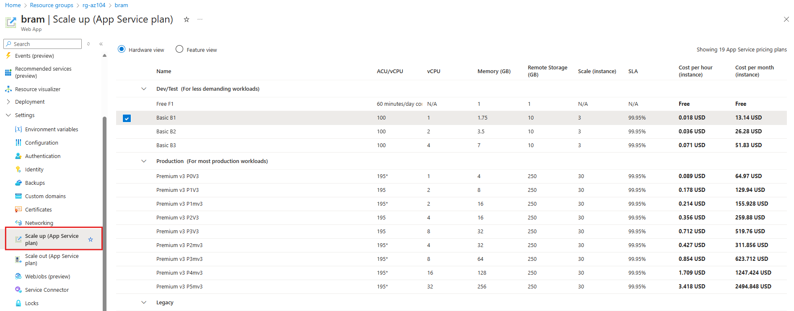
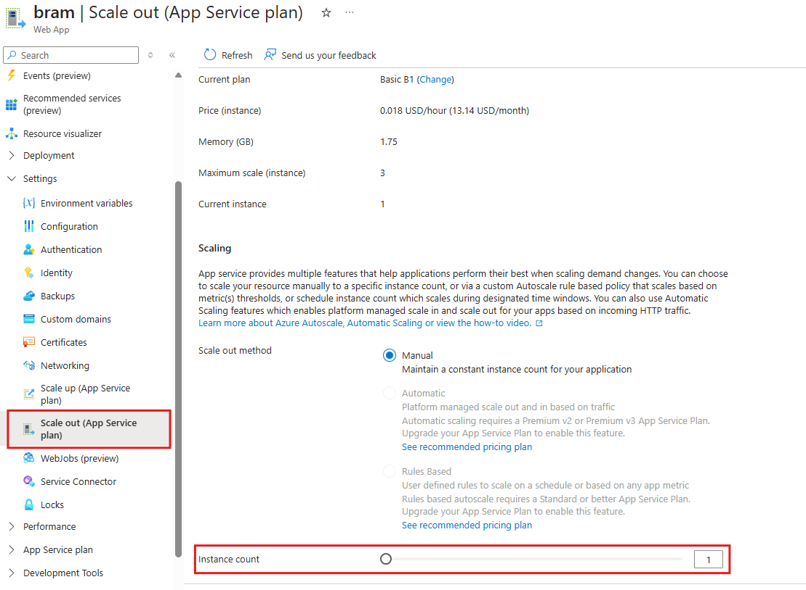
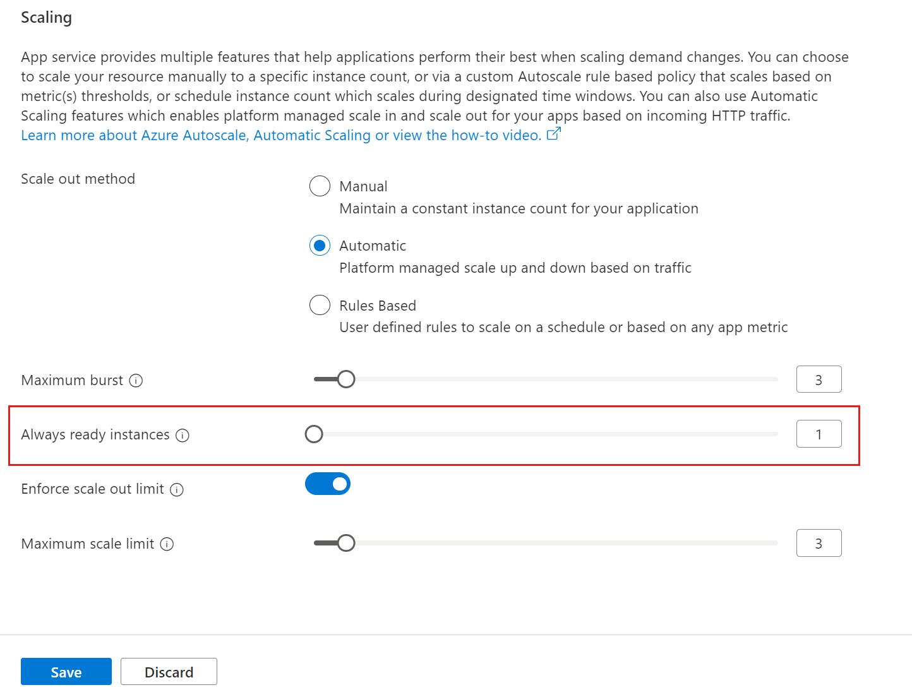

# Wat is een Azure app service plan?
Voordat ik de omschrijving verder toelicht, laten we beginnen hoe [Microsoft](https://learn.microsoft.com/en-us/azure/app-service/overview-hosting-plans) een Azure App Service Plan defineerd:

> An Azure App Service plan defines a set of compute resources for a web app to run. An app service always runs in an App Service plan. Azure Functions also has the option of running in an App Service plan.

De naam zegt het al deels, maar een Azure App Service Plan is een verzameling *compute resources* voor het draaien van een webapplicatie. Bij het aanmaken van een Azure Plan Service Plan ben je altijd vereist om OS-Type te definieren (Windows of Linux), regio (West europa), aantal en grote van virtual machines en de pricing tier (Free, Shared, Basic, Standard, Premium, PremiumV2, PremiumV3, IsolatedV2). 

In de documentatie van [Microsoft](https://learn.microsoft.com/en-us/azure/app-service/overview-hosting-plans#pricing-tiers) zijn de pricing tiers uitgebreid toegelicht van App Service. De belangrijkste kenmerken van de pricing tiers heb ik hieronder kort opgesomd:
- Shared compute (Free, Shared): Je deelte de compute resources met andere Azure klanten. De Azure app zal voor elke App CPU quotas hanteren. Je hebt de mogelijk niet om uit te breiden. 
- Dedicated compute (Basic, Standard, Premium, PremiumV2, PremiumV3): Alleen apps in dezelfde Azure Plan service delen dezelfde resources. Hoe hoger de tier, hoe meer VM je kan opschalen. 
- Isolated (IsolatedV2): Virtual machines draaien op een eigen virtual network. Hierdoor heb je beschikking over netwerk isolatie bovenop te compute isolatie. In deze tier heb je de meeste schaalbaarheid. 

Buiten de schaalbaarheid, zijn per tier ook extra functionaliteiten opgesteld. Microsoft geeft aandat je niet voor de functionaliteiten betaald, dus als je ze inzet, maar alleen voor de geselecteerde tier. Bijvoorbeeld in de free tier, kan je geen certificaten gebruiken voor je web app. Hiervoor heb je minimaal de basic tier nodig. Microsoft heeft dit op deze [pagina](https://learn.microsoft.com/en-us/azure/azure-resource-manager/management/azure-subscription-service-limits#azure-app-service-limits) uitgebreid toegelicht door middel van een tabel. Microsoft geeft als voorbeeld aan dat je met de basic tier kan beginnen, en als je meer functionaliteiten nodig hebt zoals een custom domain, dan kan je opschalen naar een shared tier. Mocht je opnieuw een functionaliteit nodig hebben als TLS binding, dan kan je opnieuw opschalen naar de basic tier. Je kan ook weer downgraden.

## Wanneer meer App service plans aanmaken?
Ik denk dat het belangrijk is om te vermelden wanneer het handig is om aparte App Service Plans te creëren. Afhankelijk van de tier betaal je voor de CPU quota (shared tier), het aantal VM instances (basic, premium tier) of isolated workers (Isolated V2 tier).

Het creëren van veel App Service Plans kan aantrekkelijk lijken, maar het kan ook aanzienlijke kosten met zich meebrengen. Daarnaast moet je rekening houden met het feit dat alle apps in een App Service Plan dezelfde compute resources delen. Als je dus drie apps draait in één App Service Plan, zullen al deze apps dezelfde resources gebruiken.

## Scale up an app in Azure App Service
Microsoft biedt twee schaalbaarheidsopties aan. Een hiervan is "Scale Up" (ook wel vertical scaling genoemd), wat betekent dat je extra resources toekent aan een Azure VM instance. De andere mogelijkheid is "Scale Out" (ook wel horizontal scaling genoemd), wat inhoudt dat je meer VM instances toevoegt.

### Scale up (App Service plan)
Zoals hierboven al is toegelicht, kun je de resources van een VM instance uitbreiden. Dit kun je eenvoudig doen door het Azure App Service Plan te openen, vervolgens het menu "Settings" te openen en "Scale up (App Service Plan)" te selecteren. In het geopende venster kun je vervolgens je plan selecteren.

### Scale out (App Service plan)
Bij "Scale Out" kun je afhankelijk van de tier, meerdere VM instances beschikbaar stellen voor een app. In het onderstaande voorbeeld ben ik beperkt tot 3 virtual machine instances, omdat ik gebruikmaak van de Basic tier. Dit komt overeen met de Microsoft [Azure App Service-limieten](https://learn.microsoft.com/en-us/azure/azure-resource-manager/management/azure-subscription-service-limits#azure-app-service-limits).

Als je goed kijkt naar de bovenstaande screenshot, is het ook mogelijk om automatisch uit te breiden. In mijn voorbeeld kan ik dit niet, omdat een Premium tier vereist is voor Automatic Scaling in het Azure App Service Plan. Dit staat ook beschreven op de [Microsoft Docs](https://learn.microsoft.com/en-us/azure/app-service/manage-automatic-scaling?tabs=azure-portal) pagina.

Een App Service monitort het verkeer. Wanneer de traffic zodanig hoog is voor een Azure VM instance, zal de Azure App Service een extra instance toevoegen. Tijdens het configureren van Automatic Scaling kun je het aantal burst instanties instellen. Dit zijn de maximale web instances die voor de app kunnen worden toegevoegd. Het is ook mogelijk om een minimum aantal beschikbare web instances in te stellen. Daarintegen kan je ook maximale web instances selecteren.  

## Configureer certificates and Transport Layer Security (TLS)
Standaard heeft een aangemaakte app geen certificaat. Als je dit toch wilt, heb je minimaal een Basic tier nodig. Beschik je nog over een Free of Shared tier? Dan kun je eenvoudig uitbreiden via "Scale Up." Zodra je dit hebt ingesteld, kun je in het App Service Plan gemakkelijk een Azure managed certificaat toevoegen.

